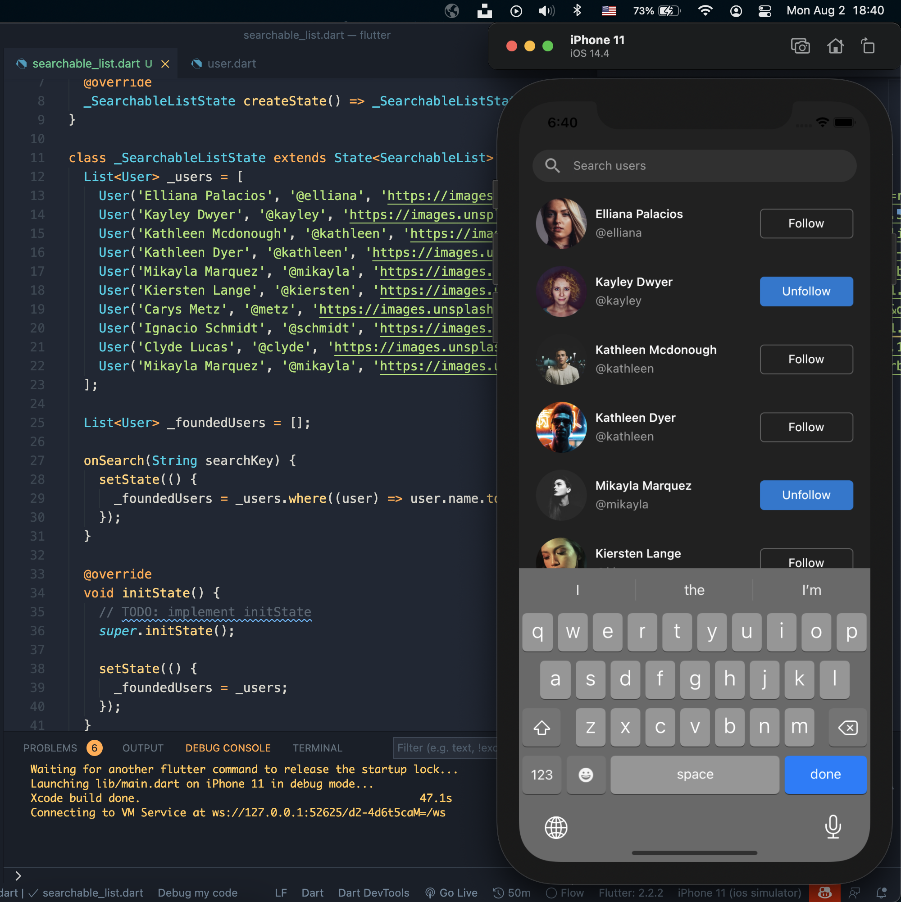
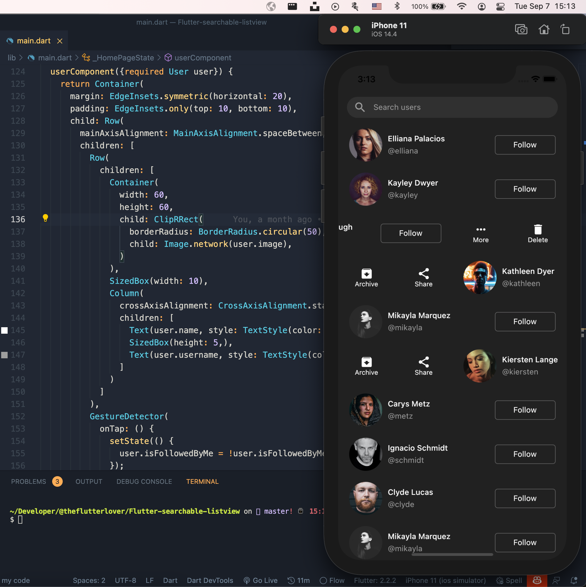

## Flutter Searchable ListView - Day 28

```dart
class Afgprogrammer extends Flutter100DaysOfCode {
  video() {
    return {
      "title": "Flutter Searchable ListView",
      "description": "Let's work with the ListView widget and make it searchable.",
      "day": 28,
      "videoLink": "https://youtu.be/9PWaRfYZ6Lg"
    }
  }
}
```
## Screenshot



